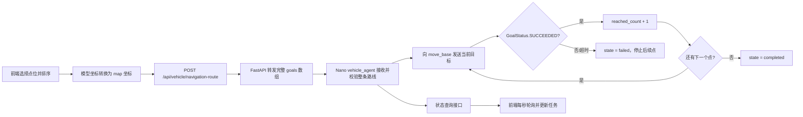

# 实验楼一定点巡航功能实现科研笔记

> 记录日期：2026-07-24  
> 研究对象：室内巡检无人车管理平台  
> 车辆：`nano1`，`192.168.31.139`  
> 地图：实验楼一 `first_floor`  
> ROS：Nano 使用 ROS 1 Melodic，远程可视化终端使用 ROS Melodic Docker

## 1. 研究目标

本阶段只实现以下闭环：

1. 用户在前端选择多个固定巡检点，或在 SLAM 地图中创建多个自定义巡检点。
2. 用户明确调整巡检点顺序和到点朝向。
3. 前端一次性提交完整有序路线。
4. 后端把路线完整转发给指定车辆。
5. 车端严格按照数组顺序逐点调用 `move_base`。
6. 只有当前点被 `move_base` 判定为 `SUCCEEDED`，车端才发送下一个点。
7. 前端依据车端确认结果显示已到达点数和最终状态。

本阶段不包含：

- 自动启动实体车辆完成整条巡检。
- 巡检点到达后的三相机拍照和 YOLO 推理编排。
- 路线全局最短路径优化。
- 多车任务调度。
- 自动判断并设置 AMCL 初始位姿。

## 2. 问题定义

给定有序导航目标集合：

```text
R = [g1, g2, ..., gn]
```

其中每个目标：

```text
gi = (frame_id, x, y, yaw, point_id, point_name)
```

需要保证以下顺序不变量：

```text
send(g1)
send(gi+1) 当且仅当 result(gi) == GoalStatus.SUCCEEDED
```

失败不变量：

```text
若任意 gi 超时、被拒绝、中止或失败，
则不再发送 gi+1 ... gn，整条路线进入 failed。
```

完成条件：

```text
reached_count == route_total == n
且 state == completed
```

前端计时器、页面动画或预计时间都不能作为“到达”依据。

## 3. 研究前的系统状态

### 3.1 已有基础

项目原有能力包括：

- React + Vite 前端。
- FastAPI 后端。
- Nano 车辆 HTTP 代理。
- ROS Melodic 导航链。
- `first_floor.yaml` 地图。
- AMCL 定位。
- `move_base + TEB` 导航。
- 雷达、里程计、TF 和底盘控制。
- 单目标 `/navigation_goal` 接口。

### 3.2 主要缺口

原有实现不能可靠证明“按顺序逐点到达”：

1. 前端任务进度包含模拟状态，不能代表车端真实到达。
2. 后端旧的兼容降级逻辑可能连续调用多次 `/navigation_goal`。
3. `move_base` 新目标会抢占旧目标，连续发送多个单点不能保证顺序到达。
4. 缺少整条路线的唯一执行编号。
5. 缺少逐点结果、当前点、已到达数量和失败点。
6. 缺少路线取消接口。
7. 实验楼一前端模型坐标不能直接作为 ROS `map` 坐标。
8. 自定义点必须排除墙体、未知区域和导航图覆盖区外区域。

## 4. 总体方案



方案的核心决策是：路线队列必须在车端执行。

后端只负责鉴权、参数校验和转发；前端只负责编辑路线和展示状态。这样即使浏览器短暂断开，已经被车端接收的路线仍能在车端保持明确状态。

## 5. 实现过程记录

### 5.1 阅读原工程与确认导航基础

首先查阅工程笔记和原有后端代码，确认：

- Nano 已具备 ROS Melodic 导航链。
- `first_floor.yaml` 已保存并可供 AMCL 使用。
- `move_base + TEB` 已经作为导航执行器。
- 后端可以通过 HTTP 访问 Nano 的车辆代理。
- 原有单目标接口可以构造 `map` 坐标目标。

由此确定本阶段不重新开发底盘、雷达、SLAM 或局部规划器，而是在已有导航链上增加完整路线语义。

### 5.2 确定路线必须由车端排队

对原兼容逻辑进行分析后发现，如果后端把路线拆成多个 `/navigation_goal` 并立即循环发送，后一个目标会抢占前一个目标。

因此将设计改为：

```text
前端一次提交完整数组
后端一次转发完整数组
车端保存数组并逐点阻塞等待 move_base 结果
```

同时删除了后端“不支持路线接口时立即发送多个单点”的降级路径。

### 5.3 扩展车端车辆代理

在 `vehicle_agent.py` 中完成：

- 完整路线参数校验。
- `execution_id` 生成。
- 单车单活动路线互斥。
- 路线执行线程。
- 逐点 `wait_for_result`。
- `GoalStatus.SUCCEEDED` 判定。
- 逐点结果数组。
- 路线查询。
- 路线取消。
- 超时、失败和取消状态。

本地源文件对应 Nano 部署位置：

```text
本地：vehicle/vehicle_agent.py
车端：/home/nano1/indoor_patrol_ws/src/indoor_patrol_bringup/scripts/vehicle_agent.py
```

部署后通过车辆服务启动脚本加载：

```bash
bash /home/nano1/indoor_patrol_ws/src/indoor_patrol_bringup/scripts/start_vehicle_services.sh
```

### 5.4 扩展后端路线接口

后端增加车端状态代理和取消代理，并扩展任务路线点模型，使固定点和自定义点都能够保存。

同时将默认车辆 ID 从含义不明确的 `default` 统一为 `nano1`，继续使用：

```text
http://192.168.31.139:9000
```

作为车辆代理地址。

### 5.5 标定实验楼一固定点

根据前端模型、SLAM 覆盖矩形、PGM 尺寸、YAML 分辨率和 origin，把覆盖区内固定点转换成 `map` 坐标。

只开放已经落入 `first_floor` 覆盖区并完成转换的 `LAB-P02` 至 `LAB-P06`，避免把仅用于平面图展示的点直接下发给 ROS。

### 5.6 完成前端有序路线编辑

前端先完成固定点路线：

- 地图和列表均可点选。
- 点选顺序写入数组。
- 支持上移、下移、删除和反向执行。
- 创建任务时保存最终数组顺序。

然后增加自定义点模式：

- 点击 SLAM 图生成临时点。
- 恢复 SVG 模型坐标。
- 检查覆盖范围和栅格自由空间。
- 显示转换后的 `map` 坐标。
- 设置每个点的最终 yaw。

### 5.7 将前端任务进度改为车端确认

任务开始后不再根据定时动画模拟到点，而是保存车端返回的 `execution_id`，每秒查询一次路线状态。

只有车端更新 `reached_count` 时，前端进度才增长；只有车端返回 `completed` 时，前端才显示完成。

### 5.8 处理页面布局问题

自定义点和 SLAM 地图加入后，超宽窗口中出现 SVG 高度溢出。随后重新划分地图、路线侧栏、说明、摘要和按钮区域，并同时验证固定点与自定义点模式。

### 5.9 整理远程 RViz 与 AMCL 流程

现场虚拟机使用 ROS 2 Jazzy，无法直接连接 Nano 的 ROS 1 Master，因此采用：

```text
VMware 桥接网络
  → ROS Melodic Docker
  → ROS_MASTER_URI 指向 Nano
  → 容器内启动 RViz
```

并明确将 RViz “2D Pose Estimate” 作为路线执行前的人工定位校准步骤。

## 6. 地图坐标与方向建模

### 6.1 地图参数

实验楼一地图配置：

```yaml
image_size:
  width: 790
  height: 1360
resolution: 0.05
origin: [-14.482376, -55.031775, 0]
```

前端模型中的 SLAM 覆盖区域：

```text
coverage.x = 60000
coverage.y = 3000
coverage.width = 39000
coverage.depth = 64000
```

### 6.2 模型坐标到像素坐标

对模型点 `(modelX, modelY)`：

```text
normalizedX = (modelX - coverage.x) / coverage.width
normalizedY = (modelY - coverage.y) / coverage.depth

pixelX = normalizedX × imageWidth
pixelY = normalizedY × imageHeight
```

若地图配置要求翻转，则在归一化值上应用 `1 - normalized`。当前 `first_floor` 设置：

```text
flipX = false
flipY = false
```

### 6.3 像素坐标到 ROS map 坐标

PGM 图像的像素 Y 轴向下，而 ROS 地图 Y 轴向上，因此：

```text
mapX = originX + pixelX × resolution
mapY = originY + (imageHeight - pixelY) × resolution
```

最终坐标保留三位小数。

对应实现：

```text
frontend/src/utils/navigationCoordinates.js
```

### 6.4 到点朝向

前端使用易理解的方向名称，提交前转换成 ROS yaw：

| 方向 | yaw/rad | 地图轴 |
| --- | ---: | --- |
| east | `0` | `+X` |
| north | `π/2` | `+Y` |
| west | `π` | `-X` |
| south | `-π/2` | `-Y` |

车端再将 yaw 转换成四元数：

```text
qz = sin(yaw / 2)
qw = cos(yaw / 2)
qx = 0
qy = 0
```

这里的东南西北是地图坐标约定，不是真实地理指南针方向。

## 7. 固定巡检点标定

当前 `first_floor` 覆盖区中开放五个固定点：

| 点位 | 名称 | `map x` | `map y` | `yaw` |
| --- | --- | ---: | ---: | ---: |
| LAB-P02 | 北侧东段 | -2.329 | -1.907 | 0.000 |
| LAB-P03 | 东北转角 | 19.954 | -1.907 | -1.571 |
| LAB-P04 | 东侧中段 | 19.954 | -20.501 | -1.571 |
| LAB-P05 | 东南转角 | 19.954 | -39.094 | 3.142 |
| LAB-P06 | 南侧东段 | -2.329 | -39.094 | 3.142 |

只显示 SLAM 覆盖区内的固定点，未标定或覆盖区外点不参与本次路线。

固定点数据位于：

```text
frontend/src/data/labBuildingMap.js
```

## 8. 自定义巡检点设计

### 8.1 交互模式

在实验楼一“点位与路线”步骤中增加：

- 固定点位模式。
- 自定义点位模式。

自定义模式下，用户在 SLAM 地图上点击，系统依次生成：

```text
CUSTOM-P01
CUSTOM-P02
CUSTOM-P03
...
```

新建点默认朝向为 `east`，之后可以在路线列表中修改。

### 8.2 点击坐标恢复

SVG 使用缩放后的显示尺寸，不能直接把鼠标 `clientX/clientY` 当作模型坐标。

实现中通过：

```text
SVGPoint
getScreenCTM().inverse()
matrixTransform()
```

将屏幕点击位置还原为 SVG 模型坐标。

### 8.3 自由空间检查

自定义点必须同时满足：

1. 位于 `first_floor` 覆盖矩形内。
2. SLAM 图像已经加载。
3. 点击像素附近 `7 × 7` 邻域均为高亮自由空间。
4. 邻域平均亮度阈值不低于 `225`。

检查半径为 `3 px`。地图分辨率为 `0.05 m/px`，因此名义上的像素安全边距约为：

```text
3 × 0.05 = 0.15 m
```

该检查用于阻止把目标直接放在黑色墙体、灰色未知区域或紧贴障碍物处。

这只是前端预检查，最终能否到达仍由 `move_base` 的全局和局部代价地图决定。

## 9. 前端实现

主要文件：

```text
frontend/src/pages/ClusterControl.jsx
frontend/src/styles/ClusterControl.css
frontend/src/utils/navigationCoordinates.js
frontend/src/data/labBuildingMap.js
```

### 9.1 表单数据

任务表单增加：

```text
pointMode
selectedPointIds
routePoints
```

其中：

- `pointMode=fixed` 时使用固定点 ID 数组。
- `pointMode=custom` 时使用完整的自定义点对象数组。
- 数组顺序就是车端执行顺序。

### 9.2 路线编辑

实现的操作：

- 点击添加或取消固定点。
- 点击地图添加自定义点。
- 上移。
- 下移。
- 删除。
- 反向执行。
- 修改自定义点到点朝向。
- 清空自定义路线。

### 9.3 路线下发

点击任务“开始”时：

```text
固定路线：buildNavigationGoals(pointIds, mapData)
自定义路线：buildNavigationGoalsFromPoints(routePoints, mapData)
```

构造完整 `goals` 后调用：

```text
POST /api/vehicle/navigation-route
```

请求示例：

```json
{
  "vehicle_id": "nano1",
  "task_id": "task-001",
  "speed": 0.35,
  "goals": [
    {
      "frame_id": "map",
      "x": -2.329,
      "y": -1.907,
      "yaw": 0,
      "point_id": "LAB-P02",
      "point_name": "北侧东段"
    },
    {
      "frame_id": "map",
      "x": 19.954,
      "y": -1.907,
      "yaw": -1.571,
      "point_id": "LAB-P03",
      "point_name": "东北转角"
    }
  ]
}
```

### 9.4 状态轮询

车端返回 `execution_id` 后，前端每秒请求：

```text
GET /api/vehicle/navigation-route/status
```

前端根据：

```text
progress = reached_count / route_total × 100%
```

更新任务进度。

状态映射：

| 车端状态 | 前端状态 |
| --- | --- |
| `queued` / `moving` / `arrived` | 执行中 |
| `completed` | 已完成 |
| `failed` | 异常 |
| `cancelled` | 待审核/已取消 |

### 9.5 页面排版修正

在超宽屏测试中曾出现 SLAM SVG 根据宽度放大后高度过大，覆盖右侧路线、摘要和操作按钮。

最终调整：

- 表单改为纵向四行网格。
- 路线编辑区改为“弹性地图 + 固定宽度侧栏”。
- SVG 同时受容器宽度和高度约束。
- 地图容器使用 `overflow: hidden`。
- 说明、摘要和操作区使用独立网格行。
- 为窄屏和低高度窗口增加响应式布局。

在约 `2544 × 1286` 页面视口中验证固定点和自定义点两种模式均无覆盖。

## 10. 后端实现

主要文件：

```text
backend/main.py
backend/vehicle_client.py
```

### 10.1 数据模型扩展

任务路线点增加：

```text
yaw
direction
recognitionTargets
temporary
```

任务增加：

```text
pointMode
routePoints
```

这样后端能够保存固定点模式和自定义点模式的差异。

### 10.2 API

新增或完善：

```text
POST /api/vehicle/navigation-route
GET  /api/vehicle/navigation-route/status
POST /api/vehicle/navigation-route/cancel
```

路线接口至少要求一个目标。

### 10.3 删除不安全的多单点降级

旧逻辑在车端不支持 `/navigation_route` 时，可能循环请求 `/navigation_goal`。

该方案存在严重问题：

```text
goal1 刚发出
goal2 随即发出并抢占 goal1
goal3 再抢占 goal2
```

这不能证明车辆依次到达。因此当前实现不再把完整路线降级成多个立即发送的单点目标。车端不支持路线接口时直接报错，要求部署正确版本的 `vehicle_agent`。

## 11. 车端实现

主要文件：

```text
vehicle/vehicle_agent.py
```

部署目标：

```text
/home/nano1/indoor_patrol_ws/src/indoor_patrol_bringup/scripts/vehicle_agent.py
```

### 11.1 接收阶段

车端接收路线后先完成：

1. 检查 `goals` 非空。
2. 限制最多 `100` 个点。
3. 校验所有点的 `frame_id` 必须是 `map`。
4. 将全部 `x/y/yaw` 转为有限浮点数。
5. 确认 `move_base` action server 可用。
6. 检查当前没有其他路线或导航目标运行。
7. 生成 `route-<uuid>` 执行编号。
8. 初始化逐点 `results`。

整条路线先验证再接受，可以避免执行到中途才发现后续点格式错误。

### 11.2 顺序执行线程

车端使用独立线程执行路线：

```text
for goal in goals:
    send_goal(goal)
    wait_for_result(timeout)
    if result != SUCCEEDED:
        fail route
        return
    reached_count += 1
complete route
```

单点默认等待超时：

```text
route_goal_timeout = 180 s
```

点间默认暂停：

```text
route_arrival_pause = 0.5 s
```

### 11.3 路线状态

车端保存：

```text
execution_id
active
mode
state
task_id
point_id
point_name
route_index
route_total
reached_count
results
last_status
last_error
started_at
updated_at
completed_at
```

每个点保存：

```text
index
point_id
point_name
state
started_at
finished_at
move_base_state
error
```

### 11.4 HTTP 接口

车端提供：

```text
POST /navigation_route
GET  /navigation_route/status
POST /navigation_route/cancel
POST /navigation_goal
POST /stop
GET  /status
```

路线被接受时返回 HTTP `202`。

### 11.5 取消语义

取消路线时：

1. 检查执行编号是否匹配。
2. 调用 `cancel_all_goals()`。
3. 将 `active` 设为 `false`。
4. 将状态设为 `cancelled`。
5. 路线线程检测到非活动状态后退出。
6. 后续点不再发送。

## 12. AMCL、朝向与路线的关系

车端代理本身不负责计算小车当前地图位置。实际定位由：

```text
激光雷达 + 里程计 + AMCL + TF
```

完成。

TF 链：

```text
map → odom → base_footprint → base_link → laser_link
```

RViz 的 “2D Pose Estimate” 设置的是初始 `(x, y, yaw)`。如果箭头方向与真实车头相反，即使目标坐标正确，局部规划器也可能出现原地转圈、反向尝试或不运动。

因此定点巡航开始前必须先完成 AMCL 校准。

## 13. 速度控制结论

前端当前定义：

```text
NAVIGATION_SPEED = 0.35
```

并把该值放入路线和每个目标。

但车端构造 `MoveBaseGoal` 时只使用：

```text
frame_id
x
y
yaw
```

并未根据 `speed` 动态修改 TEB。因此实际速度仍由 Nano 参数限制：

```text
TEB max_vel_x ≈ 0.08 m/s
TEB max_vel_theta ≈ 0.15 rad/s
navigation_safety max_linear ≈ 0.08 m/s
navigation_safety max_angular ≈ 0.15 rad/s
```

这保证了当前试验仍使用低速配置，但也形成一个待改进项：前端显示的速度参数不能被描述为车辆实际执行速度。

## 14. 验证过程与结果

### 14.1 静态和构建验证

已完成：

- 前端生产构建通过。
- `ClusterControl.jsx` 定向 ESLint 检查通过。
- Git 差异空白检查通过。
- 固定点和自定义点页面布局自动化尺寸检查通过。
- 车端路线状态机代码完成。
- 后端路线状态与取消转发接口完成。
- `vehicle_agent.py` 已准备为 Nano 部署源文件。

### 14.2 状态验证

实现阶段确认车端路线接口能够返回空闲状态：

```text
state = idle
active = false
```

这说明车辆代理没有残留的活动路线。

### 14.3 未执行的验证

按照任务约束，本次没有直接向车辆下发有效巡检目标，也没有启动车辆跑完整路线。

因此当前结论应分为：

```text
软件功能实现：完成
接口和状态机实现：完成
页面编辑与坐标转换：完成
真实车辆整线顺序到达试验：待现场验收
```

不能仅凭软件构建通过就宣称“实车逐点巡航已经完成验证”。

## 15. 建议的实车科研验证方案

### 15.1 试验一：两点顺序性

路线：

```text
LAB-P02 → LAB-P03
```

记录：

- 路线接收时间。
- `execution_id`。
- 每次 `goal_sent` 时间。
- 每次 `goal_reached` 时间。
- `move_base_state`。
- `reached_count` 变化。
- 车辆实际位置。

通过标准：

```text
LAB-P03 的 started_at
必须晚于或等于
LAB-P02 的 finished_at
```

### 15.2 试验二：主动取消

在前往第一点过程中点击暂停。

通过标准：

- 当前目标被取消。
- `state=cancelled`。
- `active=false`。
- 第二点没有进入 `moving`。
- 小车速度回到零。

### 15.3 试验三：不可达点

在安全条件下使用确定不可规划但不会造成碰撞的测试点。

通过标准：

- 当前点进入 `failed`。
- `last_error` 有明确原因。
- 后续点保持 `pending`。
- 前端显示异常而不是完成。

### 15.4 试验四：自定义点

在同一条直走廊白色自由区选择两个自定义点。

记录：

- 前端模型坐标。
- 转换后的像素坐标。
- 转换后的 `map x/y`。
- RViz 中目标位置。
- 实车停止位置误差。

### 15.5 建议指标

| 指标 | 计算方式 |
| --- | --- |
| 路线成功率 | 完成路线数 / 总试验路线数 |
| 单点成功率 | `SUCCEEDED` 点数 / 下发点数 |
| 顺序违规次数 | 后点在前点成功前启动的次数 |
| 到点位置误差 | 实际终点与目标点欧氏距离 |
| 到点角度误差 | 实际 yaw 与目标 yaw 的最小角差 |
| 单点耗时 | `finished_at - started_at` |
| 取消延迟 | 取消请求到速度归零的时间 |
| 定位跳变次数 | AMCL 位姿明显突变次数 |

## 16. 当前限制与后续研究

### 16.1 地图覆盖有限

当前 `first_floor` 只开放已标定覆盖区。完整实验楼建图和回环优化完成后，应重新校准：

- SLAM 图像尺寸。
- YAML 原点。
- 前端覆盖矩形。
- 固定巡检点。

### 16.2 自定义点自由空间判断较简单

当前使用图像亮度和固定像素邻域判断，不等价于 ROS costmap。

后续可改为：

- 后端调用 `make_plan` 服务预检查。
- 使用机器人外接圆半径膨胀栅格。
- 显示目标到最近障碍物距离。
- 在提交前验证整条路线每一段的可规划性。

### 16.3 路线状态只保存在车端内存

`vehicle_agent` 重启后当前执行状态会丢失。后续可把：

```text
execution_id
task_id
results
timestamps
errors
```

持久化到后端数据库。

### 16.4 页面刷新后的恢复能力

前端轮询器存在浏览器运行内存中。页面刷新后应根据任务保存的 `execution_id` 自动恢复轮询，这是后续需要重点验证和完善的内容。

### 16.5 单车单路线限制

当前车端只允许一个导航执行活动。该限制符合单车安全原则，但多车系统需要：

- 每车独立 agent。
- 后端车辆注册表。
- 每车独立任务锁。
- 统一调度和冲突处理。

### 16.6 车辆代理的网络安全

车辆代理部署在局域网，接口本身没有独立鉴权。后续可增加：

- API Token。
- 来源 IP 白名单。
- HTTPS 或内网反向代理。
- 操作审计。

### 16.7 速度参数统一

需要在后续版本中二选一：

1. 删除前端 `speed`，明确速度由车端 ROS 配置统一控制。
2. 设计安全的速度档位，由车端在预设上限内应用，而不是允许前端任意改 TEB 参数。

科研试验阶段建议采用第一种或固定档位方案。

## 17. 阶段结论

本阶段把“前端多点选择”从页面演示逻辑改造成了具有车端确认语义的有序路线系统。

关键成果：

1. 固定点和自定义点共用统一的 `map` 导航目标格式。
2. 明确完成模型坐标、PGM 像素和 ROS 地图坐标的转换。
3. 车端维护完整路线状态机和逐点结果。
4. 消除了连续发送多个单目标导致的抢占风险。
5. 前端进度改为依据车端 `reached_count`。
6. 任何点失败都会终止后续路线。
7. 支持路线取消和异常原因回传。
8. 明确区分软件实现完成与实车科研验收完成。

下一阶段的核心工作不是继续增加页面功能，而是在低速、有人监护条件下完成两点路线的顺序性、到点误差、取消延迟和失败停止试验，并保存可复核的车端状态与 ROS 日志。
