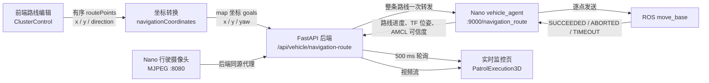

# 项目开发记录：实验楼一定点巡航、实时监控与巡检档案

## 1. 文档信息

| 项目 | 内容 |
| --- | --- |
| 记录日期 | 2026-07-29 |
| 对应提交 | `6524c24 feat: 完善定点巡航与实时监控`；`e088cbc feat: 完善巡检记录与实时监控界面` |
| 对应分支 | `master` |
| 远程仓库 | `https://github.com/1104546057-cloud/indoor` |
| 适用场景 | 实验楼一 `first_floor` 地图 |
| 适用车辆 | `nano1`，ROS 1 Melodic |
| 前端页面 | `/cluster-control`、`/patrol-3d` |

本文记录提交 `6524c24` 和 `e088cbc` 中定点巡航、逐点到达确认、到点朝向、实时车辆位置、路线进度、车载视频、停止巡检、巡检档案、历史路线、识别证据和人工复核等功能的实现，供后续开发、部署和排查问题时参考。

## 2. 本次开发目标

本次开发将原有的前端路线演示能力补全为一条可连接真实车辆的闭环：

1. 用户在实验楼一地图中按顺序选择多个巡检点。
2. 用户可以分别设置每个点的到达朝向。
3. 前端将整条有序路线一次性提交给后端。
4. 后端将路线原样转发给 Nano 上的车辆 agent。
5. 车端只有在前一点被 `move_base` 确认 `SUCCEEDED` 后，才发送下一点。
6. 前端实时读取车端的路线进度、AMCL 位姿和车辆状态。
7. `/patrol-3d` 使用真实 `map → base_link` 位姿更新车辆模型，并显示行驶摄像头视频。
8. 用户可以从监控页取消正在执行的路线。

本次没有把“按时间播放动画”作为真实到点依据。实时模式下的到点数量和任务状态均以车端 `move_base` 执行结果为准。

## 3. 系统数据流



### 3.1 路线下发原则

后端不再在车端缺少路线接口时降级为连续调用多个单点接口。降级发送无法保证前一点已经到达，因此现在要求车端必须提供 `/navigation_route`：

```text
前端完整路线
  → 后端完整转发
    → 车端保存全部 goals
      → goal 1 SUCCEEDED
        → goal 2 SUCCEEDED
          → ...
            → route completed
```

## 4. 已实现功能

### 4.1 多巡检点有序路线

主要代码：

- [frontend/src/pages/ClusterControl.jsx](../frontend/src/pages/ClusterControl.jsx)
- [frontend/src/utils/navigationCoordinates.js](../frontend/src/utils/navigationCoordinates.js)
- [backend/main.py](../backend/main.py)
- [backend/vehicle_client.py](../backend/vehicle_client.py)
- [vehicle/vehicle_agent.py](../vehicle/vehicle_agent.py)

实现内容：

- 实验楼一地图支持点击添加自由巡检点。
- 点位按照用户点击顺序进入 `routePoints`。
- 支持上移、下移、删除、反向执行和清空路线。
- 创建任务时保存完整点位对象，不再只保存点位 ID。
- 下发前将模型坐标转换为 ROS `map` 坐标。
- 后端一次性转发完整 `goals` 数组。
- 车端创建唯一 `execution_id`，在独立线程中顺序执行。
- 每个目标均记录 `queued`、`moving`、`arrived`、`failed` 或 `cancelled` 状态。
- 任一点超时或 `move_base` 返回非 `SUCCEEDED` 时，整条路线进入 `failed`，不会继续发送后续点。

### 4.2 每个巡检点设置到点朝向

路线列表中新增“到点朝向”选择框，支持四个方向：

| 页面选项 | ROS yaw | `map` 坐标含义 |
| --- | ---: | --- |
| 东 | `0` | 朝 `map +X` |
| 北 | `π/2`，约 `1.571` | 朝 `map +Y` |
| 西 | `π`，约 `3.142` | 朝 `map -X` |
| 南 | `-π/2`，约 `-1.571` | 朝 `map -Y` |

实现细节：

- `ARRIVAL_DIRECTIONS` 定义四个方向及页面文案。
- `pointDirections` 保存当前表单中每个点的朝向覆盖值。
- 自由点默认朝向为 `east`。
- `getPlanRoutePoints()` 在创建任务前合并点位和朝向。
- 地图中使用黄色箭头预览每个点的到达朝向。
- 后端 `TaskRoutePointRequest` 增加 `direction` 和 `yaw` 字段。
- `point_payload` 和任务 JSON 中会保留朝向，任务重新读取后不会丢失。
- `modelPointToSlamGoal()` 同时支持方向字符串和数值 yaw。

注意：这里的“东南西北”是 ROS `map` 坐标方向，不是地理罗盘方向。只有地图坐标轴与建筑真实方位经过标定时，两者才会一致。

### 4.3 车端逐点到达确认

[vehicle/vehicle_agent.py](../vehicle/vehicle_agent.py) 新增了可部署到 Nano 的车辆 agent。

核心行为：

- 使用 `actionlib.SimpleActionClient("move_base", MoveBaseAction)`。
- 接收到路线后先检查 `move_base` action server 是否可用。
- 每次只发送一个 `MoveBaseGoal`。
- `wait_for_result()` 返回成功且状态为 `GoalStatus.SUCCEEDED` 后，才更新 `reached_count` 并发送下一点。
- 默认单点超时时间为 `180 s`。
- 默认到点停顿为 `0.5 s`。
- 路线执行过程中，agent 不再发布手动 `/cmd_vel`，避免与 `move_base` 抢占控制。
- 新的手动控制、停止命令或取消路线会调用 `cancel_all_goals()`。
- 已有路线执行时再次下发路线会返回 HTTP `409`。

主要状态字段：

```json
{
  "execution_id": "route-...",
  "active": true,
  "state": "moving",
  "task_id": "task-...",
  "point_id": "LAB-FREE-001",
  "point_name": "自由点1",
  "route_index": 1,
  "route_total": 3,
  "reached_count": 0,
  "results": [],
  "last_error": null
}
```

终态包括：

- `completed`：全部点位成功到达。
- `failed`：某一点超时、被 `move_base` 拒绝或执行异常。
- `cancelled`：用户取消路线或发送停止/手动控制命令。

### 4.4 真实定位与定位可信度

车端 `/status` 不再只返回速度和电压，还会返回真实地图位姿和定位状态：

- TF：`map → base_link`
- AMCL：`/amcl_pose`
- 位置：`x`、`y`
- 姿态：四元数和 yaw
- 位姿时延：`pose_age`
- AMCL 协方差：`covariance_x`、`covariance_y`、`covariance_yaw`

默认可信度限制：

| 参数 | 默认值 |
| --- | ---: |
| `pose_stale_timeout` | `2.0 s` |
| `max_covariance_x` | `0.5` |
| `max_covariance_y` | `0.5` |
| `max_covariance_yaw` | `0.8` |

只有 TF 可用、位姿未过期且 AMCL 协方差不超限时，`localization.valid` 才为 `true`。前端在定位无效时不会继续使用一个看似正常但实际不可信的位置。

### 4.5 `/patrol-3d` 实时监控

主要代码：

- [frontend/src/pages/PatrolExecution3D.jsx](../frontend/src/pages/PatrolExecution3D.jsx)
- [frontend/src/styles/PatrolExecution3D.css](../frontend/src/styles/PatrolExecution3D.css)
- [frontend/src/utils/patrolMonitor.js](../frontend/src/utils/patrolMonitor.js)

实时模式实现：

- 每 `500 ms` 请求一次车辆状态。
- 根据 `execution_id` 请求对应路线状态。
- 使用真实 `map → base_link` 位姿更新 Three.js 中的车辆位置。
- 将 ROS 地图坐标反算为实验楼一模型坐标。
- 使用车端 `route_index` 和 `reached_count` 更新当前点和总进度。
- 显示车辆在线/离线、速度、电压、定位可信度和路线错误。
- 支持实时、俯视和跟随视角。
- 实时视频不可用时每 `3 s` 自动重连，也支持点击立即重试。
- “停止巡检”会调用取消路线接口，不只是暂停网页动画。

回放模式仍然保留，但通过 URL 参数 `replay=1` 与真实模式明确区分。回放模式可以按时间播放；真实模式只信任车端状态。

#### 车辆旋转方向修正

ROS 与 Three.js 的坐标轴定义不同：

- ROS：yaw 为 `0` 时朝 `map +X`，正 yaw 朝 `map +Y` 旋转。
- Three.js 场景：车辆模型车头沿局部 `+Z`，地图 `+Y` 绘制到场景 `-Z`。

当前换算为：

```js
sceneRotation = Math.PI / 2 + rosYaw
```

该修正解决了监控页面中车辆旋转方向与现实相反的问题。

### 4.6 监控上下文保存

[frontend/src/utils/patrolMonitor.js](../frontend/src/utils/patrolMonitor.js) 使用 `sessionStorage` 保存：

- `executionId`
- `taskId`
- `taskName`
- `sceneId`
- `vehicleId`
- `routePoints`
- 转换后的导航目标

上下文分别按照“最新任务、execution ID、task ID”建立索引。刷新 `/patrol-3d` 时可恢复当前浏览器标签页中的监控任务。

注意：`sessionStorage` 仅属于当前浏览器标签页。关闭标签页或换浏览器后，不应依赖它作为永久任务存储；永久任务数据仍由后端数据库保存，真实执行状态仍由车端 agent 保存。

### 4.7 行驶摄像头和同源代理

新增文件：

- [vehicle/indoor-patrol-movement-camera.service](../vehicle/indoor-patrol-movement-camera.service)

实现内容：

- Nano 使用用户级 systemd 服务运行行驶摄像头 MJPEG 服务。
- 默认设备为 `/dev/video0`。
- 默认监听 `0.0.0.0:8080`。
- 默认输出 `640 × 480`、`20 FPS`、JPEG 质量 `85`。
- 服务退出后自动重启。
- 后端增加 `camera_role=movement` 参数。
- 浏览器不直接访问 Nano 私网地址，而是通过 `/api/vehicle/camera/stream` 同源代理视频流。

这样可以避免浏览器跨域、混合内容和私网访问限制导致的视频不可用问题。

### 4.8 数据库兼容迁移

[backend/init_db.py](../backend/init_db.py) 新增幂等的旧库兼容迁移，为 `tb_recognition_result` 检查并补充：

- `inspection_record_id`
- `image_id`
- `device_item_id`
- `numeric_value`
- 对应索引
- 对应外键

原因是 SQLAlchemy `create_all()` 只会创建不存在的表，不会自动修改已存在的表。新迁移会先检查数据库结构，只添加缺失对象。

### 4.9 直线里程计诊断脚本

新增文件：

- [vehicle/collect_straight_odom_diagnostics.sh](../vehicle/collect_straight_odom_diagnostics.sh)

该脚本用于采集直线前进/后退时的：

- `/cmd_vel`
- `/odom`
- `/imu`
- `/tf`

用于判断雷达与地图错位是否来自底盘里程计、编码器或 IMU。它属于定位问题诊断工具，不会自动修复底盘参数。

## 5. 前后端与车端接口

### 5.1 前端调用的后端接口

| 方法 | 路径 | 用途 |
| --- | --- | --- |
| `POST` | `/api/tasks` | 保存任务、点位顺序和到点朝向 |
| `POST` | `/api/vehicle/navigation-route` | 下发整条有序路线 |
| `GET` | `/api/vehicle/navigation-route/status` | 读取指定路线执行状态 |
| `POST` | `/api/vehicle/navigation-route/cancel` | 取消指定路线 |
| `GET` | `/api/vehicle/status` | 读取车辆、TF、AMCL 和导航状态 |
| `GET` | `/api/vehicle/camera` | 获取摄像头信息 |
| `GET` | `/api/vehicle/camera/stream` | 同源代理 MJPEG 视频 |
| `GET` | `/api/vehicle/lidar` | 获取雷达 WebSocket 配置 |

除设备回传接口外，上述页面接口需要有效登录 Cookie。

### 5.2 后端调用的车端接口

| 方法 | 车端路径 | 用途 |
| --- | --- | --- |
| `GET` | `/health`、`/status` | 车辆健康、定位和路线状态 |
| `POST` | `/cmd_vel` | 手动速度控制 |
| `POST` | `/stop` | 停车并取消当前路线 |
| `POST` | `/navigation_goal` | 单个导航目标 |
| `POST` | `/navigation_route` | 接收整条有序路线 |
| `GET` | `/navigation_route/status` | 查询路线进度 |
| `POST` | `/navigation_route/cancel` | 取消路线 |

### 5.3 路线任务中的点位格式

任务保存阶段：

```json
{
  "id": "LAB-FREE-001",
  "name": "自由点1",
  "targetName": "自由点1",
  "x": 72000,
  "y": 17000,
  "direction": "north",
  "yaw": "north"
}
```

导航下发阶段：

```json
{
  "frame_id": "map",
  "x": -2.329,
  "y": -1.907,
  "yaw": 1.571,
  "point_id": "LAB-FREE-001",
  "point_name": "自由点1"
}
```

字符串方向只存在于业务任务中。发送给 ROS 前必须转换为数值弧度。

## 6. 主要文件变更

| 文件 | 变更摘要 |
| --- | --- |
| `frontend/src/pages/ClusterControl.jsx` | 路线编辑、朝向选择、方向箭头、任务上下文、进入实时监控 |
| `frontend/src/styles/ClusterControl.css` | 朝向选择器和地图箭头样式 |
| `frontend/src/utils/navigationCoordinates.js` | 模型坐标转 SLAM 坐标、字符串/数值 yaw 支持 |
| `frontend/src/utils/patrolMonitor.js` | execution/task 监控上下文和 URL 工具 |
| `frontend/src/pages/PatrolExecution3D.jsx` | 真实位姿、真实进度、摄像头、取消路线、回放/实时模式 |
| `frontend/src/styles/PatrolExecution3D.css` | 在线状态、视频重连和监控布局 |
| `frontend/vite.config.js` | `/api` 开发代理统一到后端 `8000` 端口 |
| `backend/main.py` | 路线状态、取消、摄像头角色、任务朝向字段 |
| `backend/vehicle_client.py` | 路线状态/取消代理、禁止不可靠降级、行驶视频流 |
| `backend/init_db.py` | 旧数据库字段、索引和外键兼容迁移 |
| `backend/tests/test_business_loop.py` | 路线状态、取消和朝向持久化自动化测试 |
| `vehicle/vehicle_agent.py` | Nano 端有序路线执行器、TF/AMCL 位姿与状态接口 |
| `vehicle/indoor-patrol-movement-camera.service` | 行驶摄像头 systemd 用户服务 |
| `vehicle/collect_straight_odom_diagnostics.sh` | 直线运动里程计诊断采集 |

## 7. 开发环境启动

### 7.1 后端

在 `backend` 目录中启动：

```powershell
cd backend
C:\Users\20848\.conda\envs\py311\python.exe -m uvicorn main:app --host 127.0.0.1 --port 8000
```

开发时可以增加 `--reload`。

### 7.2 前端

```powershell
cd frontend
npm install
npm run dev -- --host 127.0.0.1
```

访问：

```text
http://localhost:5173/cluster-control
http://localhost:5173/patrol-3d
```

### 7.3 车辆注册配置

真实车辆建议在被 Git 忽略的 `backend/vehicles.json` 中配置，不要将 SSH 密码提交到仓库。

示意配置：

```json
{
  "default_vehicle_id": "nano1",
  "vehicles": [
    {
      "id": "nano1",
      "name": "实验楼一巡检车",
      "agent_base_url": "http://车辆地址:9000",
      "camera_stream_url": "http://车辆地址:8080/",
      "movement_camera_stream_url": "http://车辆地址:8080/",
      "ssh_host": "车辆地址",
      "ssh_port": 22,
      "ssh_username": "车辆用户名",
      "ssh_password": "通过本机配置填写，不提交仓库"
    }
  ]
}
```

## 8. 车端部署要点

### 8.1 同步车辆 agent

将仓库中的：

```text
vehicle/vehicle_agent.py
```

同步到 Nano：

```text
/home/nano1/indoor_patrol_ws/src/indoor_patrol_bringup/scripts/vehicle_agent.py
```

确保运行环境已经 source ROS Melodic 和工作空间，并且以下对象可用：

- ROS master
- `/move_base`
- `map → odom → base_link` TF
- `/amcl_pose`
- `/odom`
- `/cmd_vel`

### 8.2 行驶摄像头服务

将服务文件安装到：

```text
~/.config/systemd/user/indoor-patrol-movement-camera.service
```

然后执行：

```bash
systemctl --user daemon-reload
systemctl --user enable --now indoor-patrol-movement-camera.service
systemctl --user status indoor-patrol-movement-camera.service
```

如果 Nano 的摄像头不是 `/dev/video0`，需要修改服务文件中的 `--device`。

## 9. 用户操作流程

1. 启动 Nano 的底盘、雷达、地图、AMCL、`move_base` 和 vehicle agent。
2. 在 RViz 使用 `2D Pose Estimate` 设置正确初始位姿。
3. 确认激光轮廓与地图墙体重合，粒子云已经收敛。
4. 打开 `/cluster-control`。
5. 新建实验楼一巡检计划。
6. 在有效 SLAM 覆盖区内按执行顺序添加多个点。
7. 为每个点选择到点朝向。
8. 创建任务并下发路线。
9. 点击“监控”进入 `/patrol-3d`。
10. 确认页面显示车辆在线、定位可信、路线进度和实时视频。
11. 如需结束任务，点击“停止巡检”并确认取消。

## 10. 测试与验证记录

本次提交完成时执行了以下验证：

| 验证项 | 结果 |
| --- | --- |
| 前端 ESLint | 通过 |
| Vite 生产构建 | 通过 |
| 后端 `test_business_loop.py` | `7 passed` |
| 任务朝向创建、读取、删除 | 通过 |
| `north` 转换为 yaw | `1.571` |
| 数值 yaw 保持 | 通过 |
| 后端 OpenAPI 包含 `direction/yaw` | 通过 |
| 本机前端端口 `5173` | 正常 |
| 本机后端端口 `8000` | 正常 |

测试过程中没有自动向车辆发送巡检路线，也没有自动启动车辆。

## 11. 常见问题

### 11.1 下发路线返回 HTTP 409

典型信息：

```text
a navigation route is already running
```

原因：车端已有路线处于 `active=true`。

处理：

1. 先查询 `/api/vehicle/navigation-route/status`。
2. 确认旧路线是否仍在执行。
3. 必要时调用 `/api/vehicle/navigation-route/cancel`。
4. 确认状态变为 `cancelled`、`failed` 或 `completed` 后再下发新路线。

不要通过重启网页绕过该限制，因为真实路线运行在车端。

### 11.2 下发路线返回 HTTP 503

可能原因：

- 后端无法访问车辆 agent。
- vehicle agent 未启动。
- 端口 `9000` 不可达。
- ROS master、`move_base` 或 action server 未就绪。

先依次检查：

```text
GET /api/vehicle/status
GET 车辆地址:9000/health
GET 车辆地址:9000/status
```

### 11.3 视频流不可用

检查：

- systemd 用户服务是否为 `active (running)`。
- `/dev/video0` 是否存在。
- MJPEG 服务端口 `8080` 是否监听。
- `movement_camera_stream_url` 是否配置正确。
- 后端 `/api/vehicle/camera/stream?...&camera_role=movement` 是否返回 MJPEG。

### 11.4 监控车辆旋转方向错误

当前正确公式为：

```js
Math.PI / 2 + yaw
```

修改 Three.js 车辆模型的本地车头轴或地图翻转配置时，需要重新验证该公式，不能直接把 yaw 的正负号反转。

### 11.5 雷达与地图行驶后偏离

本次监控功能只读取定位结果，不会修复定位漂移。需要继续检查：

- 底盘 `/odom` 直线和旋转精度。
- 左右轮编码器极性、轮径和轮距。
- IMU 角速度方向和比例。
- 雷达外参。
- AMCL 参数和地图质量。

可以使用 `vehicle/collect_straight_odom_diagnostics.sh` 采集 `/cmd_vel`、`/odom`、`/imu` 和 `/tf` 后对比分析。

## 12. 已知限制与后续建议

### 12.1 已知限制

- 实验楼一当前导航坐标转换只适用于已经标定的 `first_floor` 覆盖区。
- 到点朝向只有四个离散方向，暂不支持任意角度输入。
- 一个 vehicle agent 同时只允许一条导航路线。
- 监控页任务上下文使用 `sessionStorage`，跨浏览器或关闭标签页后不会永久保留。
- 视频流采用 MJPEG，带宽利用率不如 H.264/WebRTC。
- AMCL 失效、TF 过期或协方差超限时，监控页无法提供可信位置。
- 路线已经被车端接收后，前后端网络短时断开不会自动取消 `move_base`；但网页会失去实时状态，恢复网络后应重新查询 execution 状态。
- 巡检记录中的“历史轨迹”当前是任务创建时保存的路线点快照和逐点到达状态，不是按照固定频率保存的稠密 `map → base_link` 里程轨迹。
- 只有后端已经保存图片和识别结果时，档案详情中的“图片证据”和“点位结果”才会显示真实内容。
- 后端尚无真实巡检档案时，页面会显示带“演示兜底数据”标识的示例档案，不能将其作为真实巡检结论。
- CSV 导出只导出当前筛选结果，不包含图片文件和 3D 数据。

### 12.2 建议的下一步

1. 把路线执行状态定期回写数据库，减少对浏览器 `sessionStorage` 的依赖。
2. 为车端设备回传接口增加 API Key 或设备证书。
3. 将 SSH 密码迁移到密钥或安全配置服务。
4. 增加任意角度 yaw 输入和地图交互式朝向拖拽。
5. 为路线增加到点停留时间、拍照动作和识别任务配置。
6. 为摄像头增加 H.264/WebRTC 低延迟通道。
7. 增加 vehicle agent systemd 服务、日志轮转和健康检查。
8. 修正底盘里程计漂移后，再扩大实验楼一完整地图覆盖范围。
9. 增加真实车辆环境中的端到端测试：下发、逐点到达、取消、断网恢复和异常点超时。

## 13. 组内交接检查清单

接手或部署前请确认：

- [ ] 已拉取包含提交 `6524c24` 的 `master`。
- [ ] 已拉取包含提交 `e088cbc` 的 `master`。
- [ ] 前端代理端口为 `8000`。
- [ ] 后端 `vehicles.json` 已在本机正确配置且未提交密码。
- [ ] Nano 上 vehicle agent 与仓库版本一致。
- [ ] Nano 上行驶摄像头服务正常。
- [ ] `move_base`、AMCL、地图和 TF 正常。
- [ ] RViz 初始位姿已经校准。
- [ ] 页面新增点位位于 SLAM 有效覆盖区。
- [ ] 每个点的到点朝向已经复核。
- [ ] 下发前确认没有另一条 active 路线。
- [ ] 实车测试区域已清场并准备急停。
- [ ] 后端 `/api/business/overview` 能返回巡检档案、路线点、图片和识别结果。
- [ ] “巡检记录”页没有“演示兜底数据”标识，或已明确当前仅用于界面演示。
- [ ] 有异常结果时，人工复核状态、人员、时间和备注能够正确回写。

## 14. 相关文档

- [实验楼一定点巡航完整启动与操作指南](实验楼一定点巡航完整启动与操作指南.md)
- [实验楼一固定巡检点有序路线使用指南](实验楼一固定巡检点有序路线使用指南.md)
- [实验楼一巡检实时监控使用指南](实验楼一巡检实时监控使用指南.md)
- [定点巡航功能实现科研笔记](定点巡航功能实现科研笔记.md)

## 15. 巡检记录与实时监控界面完善

对应提交：

```text
e088cbc feat: 完善巡检记录与实时监控界面
```

远程位置：

```text
origin/master
https://github.com/1104546057-cloud/indoor/commit/e088cbc96b08145c761bde1d196dc09790a9132b
```

本轮修改重点是把“巡检记录”从静态演示表格升级为可读取后端巡检执行实例的档案工作台，同时重新整理任务详情和历史回放入口。页面最终形成“筛选与统计 → 档案列表 → 单一详情卡 → 路线、结果、证据和复核”的信息层级。

### 15.1 修改前存在的问题

修改前的巡检记录页面主要存在以下问题：

1. “今日、结论、机器人”等筛选控件只展示外观，没有真正参与数据过滤。
2. 历史记录主要由前端任务数组和 `localStorage` 拼装，不能代表后端真实的 `InspectionRecord`。
3. 档案编号可能重复，开始时间、结束时间和耗时含有前端模拟值。
4. 表格、中间过程卡、右侧详情卡和底部时间线重复展示同一批信息。
5. 历史档案页面仍显示“实时摄像头”和“实时监控”占位卡，容易让用户误以为可以查看已经结束任务的实时流。
6. 识别结果只展示少量前端缓存数据，缺少数值、标准范围、图片关联和人工复核信息。
7. 没有历史路线快照时仍可点击 3D 回放，进入后无法获得有效路线。
8. 表格操作按钮容易换行，右侧详情区域高度不足，正文和标签字号过小。
9. 缺少搜索、排序、分页、刷新、重置和导出能力。
10. 异常原因、创建人、路线名称、完整点位结果和图片证据展示不全。

### 15.2 后端档案聚合接口扩展

修改文件：

- [backend/business_router.py](../backend/business_router.py)

`GET /api/business/overview` 继续作为业务工作台聚合接口，并扩展了巡检档案所需字段。

#### 巡检执行实例

每个 `records` 元素现在包括：

| 字段 | 含义 |
| --- | --- |
| `id` | 巡检执行实例主键 |
| `recordCode` | 唯一档案编号 |
| `taskId`、`taskName` | 关联任务 |
| `taskSceneId`、`taskArea` | 场景和区域 |
| `taskRouteId`、`routeName` | 路线标识和名称 |
| `createdBy` | 任务创建人 |
| `robotName` | 执行机器人 |
| `status`、`progress` | 执行状态和进度 |
| `currentSequence`、`pointTotal` | 当前完成序号和总点位数 |
| `failureReason` | 中断或失败原因 |
| `startedAt`、`finishedAt` | 实际开始和结束时间 |
| `routePoints` | 任务创建时保存的有序路线点快照 |

读取档案时预加载 `InspectionRecord.task.route_points`，从任务路线点中返回：

```json
{
  "id": "point-id",
  "name": "点位名称",
  "targetName": "巡检对象",
  "x": 12.3,
  "y": 45.6,
  "sequence": 1
}
```

`point_payload` 中保存的朝向等扩展字段也会合并进入路线点对象，供历史路线和 3D 回放复用。

#### 图片证据

`images` 新增 `imageType`，并保留：

- `recordId`
- `pointId`
- `cabinetId`
- `sequence`
- `fileUrl`
- `capturedAt`

前端按照 `recordId` 将图片归属到具体巡检档案，不再把全部图片混合展示。

#### 识别结果与人工复核

`results` 新增或补全：

- `robotId`
- `imageId`
- `numericValue`
- `recognitionState`
- `standardRange`
- `reviewRemark`
- `reviewedBy`
- `reviewedAt`

这些字段用于展示识别原值、标准范围、置信度、告警状态以及人工复核审计信息。

当前聚合接口最多返回最近 50 条巡检档案、200 张图片和 200 条识别结果。数据量继续增大时，应改为服务端分页接口。

### 15.3 前端真实档案数据层

修改文件：

- [frontend/src/pages/ClusterControl.jsx](../frontend/src/pages/ClusterControl.jsx)
- [frontend/src/hooks/useBusinessOverview.js](../frontend/src/hooks/useBusinessOverview.js)

页面通过以下方式读取后端数据：

```js
useBusinessOverview({ pollMs: 10000 })
```

主要处理流程：

```text
/api/business/overview
  → records / images / results
  → 根据 recordId、taskId 关联
  → buildBusinessArchiveRecords
  → 统一为前端 archive record
  → 筛选、统计、列表和详情共用同一数据源
```

`buildBusinessArchiveRecords` 完成以下工作：

1. 将后端状态统一转换为页面状态。
2. 使用真实的开始和结束时间计算耗时。
3. 关联任务、路线、机器人和区域。
4. 关联该档案的全部识别结果和图片。
5. 根据 `currentSequence / pointTotal` 生成历史点位到达状态。
6. 将 ROS 米制坐标或模型坐标转换为实验楼一地图预览坐标。
7. 根据执行结果生成创建、开始、到点、识别告警、失败和结束等关键事件。
8. 保存 `source: business`，用于区分真实后端档案和演示档案。

当后端没有任何巡检记录时，页面保留演示数据以便进行界面展示，但会显示“演示兜底数据”标识。真实业务验收时必须以没有该标识为准。

### 15.4 有效筛选、排序和导出

巡检记录页面新增以下有效控件：

- 搜索：档案编号、任务名称、区域、路线和机器人。
- 日期：全部时间、今天、近 7 天、近 30 天。
- 结论：全部、已完成、存在异常、异常或中断、待复核。
- 机器人：根据当前档案数据动态生成可选项。
- 排序：时间倒序、时间正序、异常优先。
- 重置：恢复默认筛选条件。
- 刷新：立即重新请求业务聚合接口。
- CSV 导出：导出当前全部筛选结果。
- 分页：每页 8 条，显示总条数和当前页。

四个 KPI 不再使用固定演示数字，而是根据当前筛选结果实时计算：

1. 查询结果。
2. 完成巡检。
3. 异常档案。
4. 待复核。

CSV 文件包含 UTF-8 BOM，便于 Windows Excel 正确识别中文。导出范围为筛选后的全部记录，不受当前分页限制。

### 15.5 主从式档案工作台

修改文件：

- [frontend/src/pages/ClusterControl.jsx](../frontend/src/pages/ClusterControl.jsx)
- [frontend/src/styles/ClusterControl.css](../frontend/src/styles/ClusterControl.css)

页面改为左右主从结构：

```text
历史巡检档案
├─ 顶部：标题、数据来源、搜索和筛选
└─ 内容区
   ├─ 左栏
   │  ├─ 四个 KPI
   │  ├─ 档案表格
   │  └─ 分页
   └─ 右栏
      └─ 当前选中档案详情
```

左侧表格仅保留用于比较和选择档案的关键字段：

- 档案和任务。
- 巡检时间。
- 路线和机器人。
- 路线进度。
- 异常和复核。
- 最终结论。
- 3D 回放和报告操作。

原有的中间 `PROCESS TRACE`、独立右侧重复详情、底部重复时间线和历史页面实时视频占位均已移除。历史档案只展示已经持久化的数据；正在执行任务的视频和实时位置仍由任务详情或 `/patrol-3d` 实时监控页负责。

### 15.6 档案详情标签页

右侧详情卡按数据类型分为五个标签页。

#### 任务概览

展示：

- 任务结论。
- 执行机器人。
- 实际开始和结束时间。
- 实际用时。
- 路线进度。
- 识别结果数量。
- 图片证据数量。
- 复核状态。
- 任务创建人。
- 中断或失败原因。
- 真实过程事件。

#### 历史轨迹

展示任务创建时持久化的路线点快照：

- 实验楼一地图。
- 有序路线连线。
- 点位序号和坐标。
- 已到达和未到达状态。
- 保存的到点朝向。

这里的“历史轨迹”是规划路线和逐点执行结果，不是车辆实际行驶过程中每一帧的稠密轨迹。

#### 点位结果

展示该档案关联的全部识别结果：

- 点位和巡检对象。
- 识别类型。
- 识别值和单位。
- 标准范围。
- 置信度。
- 正常、异常或告警状态。
- 识别时间。

#### 图片证据

展示后端持久化的图片缩略图、点位、图片类型和采集时间。图片使用延迟加载，减少初次打开档案页面的请求压力。

#### 异常复核

展示：

- 异常结果。
- 识别时间。
- 复核状态。
- 复核人员。
- 复核时间。
- 复核备注。

对真实后端结果执行复核时，前端调用：

```text
POST /api/recognition/results/{result_id}/review
```

成功后立即静默刷新业务数据，使档案列表、详情、AI 记录和报告状态保持一致。演示数据仍使用本地缓存，不会写入数据库。

### 15.7 回放、AI 记录和报告联动

3D 回放现在使用真实档案中的：

- `taskId`
- `recordId`
- `archiveNo`
- `routePoints`

没有历史路线点时，3D 回放按钮自动禁用，并通过按钮提示说明原因，避免用户进入空回放页面。

`/patrol-3d` 的默认视角由自由视角改为：

```js
const [viewMode, setViewMode] = useState('follow')
```

因此打开实时监控或历史回放时，默认使用车辆三维跟踪视角，仍可由用户切换其他视角。

AI 记录入口使用当前档案的完整识别结果；没有识别结果时自动禁用。存在待复核异常时，报告按钮禁用，完成复核后才允许查看或生成报告，防止报告结论早于人工审核。

### 15.8 最终排版调整

针对 2560×1440 附近屏幕中“右侧详情内容多、字号过小”的问题，最终布局进行了二次调整：

1. 四个 KPI 移入左侧主栏，宽度与档案表格完全一致。
2. 右侧详情卡从 KPI 顶部开始，获得额外的纵向显示空间。
3. 详情标题由 16 px 提高到 18 px。
4. 区域信息由 10 px 提高到 12 px。
5. 标签页文字由 9 px 提高到 11 px。
6. 概览字段名由 9 px 提高到 11 px，字段值由 11 px 提高到 13 px。
7. 时间线、点位结果、图片说明、异常复核和底部按钮字号同步放大。
8. 详情卡保留内部滚动，避免内容增加后撑破整页高度。
9. 表格操作按钮使用固定网格，不再换行。

布局提供两级响应式处理：

| 页面宽度 | 布局 |
| --- | --- |
| 大于 1500 px | 左侧弹性表格，右侧详情宽度最大约 520 px |
| 1180～1500 px | 右侧详情约 410 px，表格列适当压缩 |
| 小于 1180 px | 列表和详情上下排列，避免水平挤压 |

### 15.9 主要代码变更汇总

| 文件 | 本轮修改 |
| --- | --- |
| `backend/business_router.py` | 扩展业务总览中的档案、路线点、图片、识别和复核字段 |
| `frontend/src/pages/ClusterControl.jsx` | 真实档案转换、筛选、统计、分页、CSV、主从详情、回放/AI/报告联动和复核回写 |
| `frontend/src/styles/ClusterControl.css` | 巡检记录工作台、表格、详情标签页、证据卡、复核卡和响应式布局 |
| `frontend/src/pages/PatrolExecution3D.jsx` | 3D 实时监控和回放默认使用车辆跟踪视角 |
| `docs/项目开发记录-2026-07-29.md` | 汇总两次提交的代码和功能变更 |

本轮没有修改数据库表结构，因此不需要新增数据库迁移。后端代码更新后需要重启 FastAPI 服务，前端 Vite 开发服务可自动热更新。

### 15.10 验证结果

本轮完成以下检查：

```text
前端 ESLint                         通过
Vite 生产构建                      通过
Python 语法检查                    通过
backend/tests/test_business_loop.py 7 passed
git diff --check                   通过
前端 /cluster-control              HTTP 200
后端 /docs                         HTTP 200
```

后端测试必须使用项目实际运行的 Python 3.11 环境：

```powershell
C:\Users\20848\.conda\envs\py311\python.exe -m pytest backend/tests/test_business_loop.py -q
```

系统自带的旧 Python 不支持项目模型中使用的 `X | None` 类型语法，不能据此判断后端代码失败。

### 15.11 巡检档案页面使用流程

1. 打开 `http://localhost:5173/cluster-control`。
2. 进入“巡检任务管理”。
3. 选择“巡检记录”标签。
4. 通过搜索、日期、结论和机器人筛选目标档案。
5. 点击左侧档案行，在右侧查看详情。
6. 使用“任务概览”确认任务结果和失败原因。
7. 使用“历史轨迹”检查路线、点位顺序和已到达状态。
8. 使用“点位结果”和“图片证据”检查识别数据来源。
9. 对异常结果进入“异常复核”或 AI 记录页完成审核。
10. 复核完成后查看巡检报告。
11. 只有存在历史路线快照时才使用“3D 过程回放”。
12. 需要离线分析时，先设置筛选条件，再点击“导出 CSV”。

### 15.12 后续建议

1. 新增独立的巡检档案分页 API，替代总览接口中的固定数量限制。
2. 以固定频率保存 `map → base_link` 位姿，形成真实稠密历史轨迹。
3. 为图片证据增加原图查看、下载、点位过滤和缺图状态。
4. 把报告生成结果持久化并记录报告版本。
5. 增加复核权限、复核操作日志和二次审核流程。
6. 将演示数据改为显式开发环境开关，生产环境无档案时直接显示空状态。
7. 为巡检档案、路线快照、图片和识别结果增加端到端自动化测试。

---

## 16. v2026.07.31.1：导航稳定性、任务展示与执行后业务闭环

### 16.1 版本目标

本版本继续完善实验楼一定点巡航，重点解决以下问题：

1. RViz 所在虚拟机地址变化后，Nano 无法回连 RViz 发布节点。
2. AMCL 重新定位后，旧障碍层可能残留并干扰新路线规划。
3. 待执行任务错误展示摄像头和实时监控窗口，任务地图显示空间不足。
4. 新建任务仍使用固定日期、固定时间，机器人和优先级下拉框不完整。
5. 车端路线完成只停留在运行态接口，任务、档案、识别、复核和报告之间没有自动闭环。

### 16.2 新建任务与待执行任务展示

新建计划弹窗每次打开时重新读取浏览器当前时间，并作为默认开始日和开始时间，不再使用演示日期。机器人改为明确的 `nano1`、`nano2`、`nano3` 选项，优先级统一为：

```text
低 / 中 / 高 / 紧急
```

下拉框、日期框和时间框补充深色主题样式、悬停态、选中态和原生图标适配。

待执行任务详情不再显示无内容的摄像头和三维监控占位窗口，改为展示：

- 实验楼一层任务地图。
- 有序巡检路线。
- 巡检点编号。
- 起点标记。
- 每个点位的到点朝向。

路线 SVG 使用 `preserveAspectRatio="xMidYMid meet"` 完整适配详情卡，避免地图被裁切。

### 16.3 车端路线执行前清理 costmap

`vehicle/vehicle_agent.py` 增加 `/move_base/clear_costmaps` 调用。车辆接收一条新路线后、下发第一个目标点前执行以下过程：

```text
路线进入 preparing
→ 调用 /move_base/clear_costmaps
→ 等待激光重新写入有效障碍物
→ 开始逐点导航
```

新增 ROS 参数：

| 参数 | 默认值 | 说明 |
| --- | ---: | --- |
| `~clear_costmaps_before_route` | `true` | 是否在新路线开始前清理代价地图 |
| `~clear_costmaps_timeout` | `3.0` | 等待清理服务的超时时间，单位秒 |
| `~costmap_reset_wait` | `2.0` | 清理后等待最新激光数据写入的时间，单位秒 |

清理服务不可用时只输出警告，不直接中止路线，仍保留 move_base 原有恢复机制。

### 16.4 路线执行状态持久化

新增 `backend/navigation_workflow.py`，以后端后台监控线程持续查询车辆 agent 的权威状态。网页关闭或切换页面后，后端仍会继续同步路线。

每次路线成功下发后自动：

1. 创建或复用 `InspectionRecord`。
2. 保存车端 `execution_id`、车辆编号和任务编号。
3. 将任务更新为“执行中”。
4. 将机器人更新为“导航中”。
5. 启动后台路线状态监控。

监控过程中同步保存：

- 路线总点数。
- 已到达点数。
- 当前进度。
- 每个点位的 move_base 结果。
- 点位实际完成时间。
- 导航失败原因。

后台短暂无法访问车辆 agent 时不会直接把任务判为失败，而是保留当前状态并继续重试。FastAPI 重启后会扫描数据库中仍处于“执行中”的任务，并根据保存的 `execution_id` 恢复监控。

新增环境变量：

```dotenv
ROUTE_MONITOR_INTERVAL_SECONDS=1.0
ROUTE_MONITOR_MAX_SECONDS=86400
AUTO_CAPTURE_ON_ARRIVAL=true
```

### 16.5 任务完成后的业务闭环

车端返回 `navigation.state=completed` 后，系统自动执行：

```text
车端确认整条路线完成
→ 任务进度更新为 100%
→ InspectionRecord 标记 completed
→ 保存 finished_at 和全部到点结果
→ 机器人状态恢复 idle
→ 巡检记录页面刷新归档
→ 根据识别和复核状态决定报告是否可用
```

任务最终状态不再由浏览器按时间推测，必须以车端实际到点结果为准。

取消和失败路线同样会同步到任务与档案：

| 车端状态 | 档案状态 | 机器人状态 | 任务结果 |
| --- | --- | --- | --- |
| `completed` | `completed` | `idle` | 已完成 |
| `failed` | `failed` | `fault` | 异常 |
| `cancelled` | `cancelled` | `idle` | 待审核或已取消 |

### 16.6 到点采集、异常复核与报告门禁

开启 `AUTO_CAPTURE_ON_ARRIVAL` 后，后台监控发现新的 `arrived` 点位会调用默认识别相机采集接口。每个路线序号独立记录采集状态，因此同一路线重复经过同一点位时不会漏采。

采集失败最多重试 3 次。采集系统故障只写入 `captureEvents`，不会阻止车辆继续前往下一个巡检点。

识别结果到达后，业务状态按以下规则流转：

```text
没有异常结果
→ 已完成
→ 无需复核
→ 报告可用

存在异常或告警结果
→ 待审核
→ 报告暂不可用
→ 人工复核
→ 已完成
→ 报告可用
```

识别结果上传接口和人工复核接口都会重新计算 `postExecution`：

- `archiveReady`
- `abnormalCount`
- `reviewStatus`
- `reportReady`

这避免了任务已经出现异常但报告仍被提前标记为“已生成”的问题。

### 16.7 前端巡检记录联动

业务总览接口的档案数据新增：

- `executionId`
- `navigation`
- `postExecution`
- `captureEvents`

巡检记录时间轴现在展示真实的点位到达事件、图片采集事件、AI 识别事件和最终归档事件。任务进入终态时，前端立即静默刷新一次归档，不必等待下一个 10 秒轮询周期。

报告生成时间改为任务真实结束时间；`reportReady=false` 或仍有待复核异常时，报告保持“待生成/待复核”。当前版本完善的是页面报告业务状态，尚未增加独立 PDF 文件生成与报告版本表。

### 16.8 RViz 网络与 2D Pose Estimate 文档修正

《实验楼一定点巡航完整启动与操作指南》补充了以下现场结论：

- 虚拟机本次地址由 `192.168.31.142` 变化为 `192.168.31.143`。
- 启动容器前从 `ens33` 自动读取当前地址并设置 `ROS_IP`。
- 必须验证虚拟机到 Nano、Nano 到虚拟机双向连通。
- 旧容器不会自动更新 `ROS_IP`，地址变化后必须重新创建容器。
- “2D Pose Estimate”只修正 `map → odom`，不会让真实底盘移动。
- Nano 收不到 `/initialpose` 时，应优先排查失效的 `ROS_IP` 和 ROS 节点反向连接。
- 增加 `move_base returned state 4` 的定位、代价地图、TF 和目标点检查方法。

### 16.9 主要代码变更

| 文件 | 修改内容 |
| --- | --- |
| `backend/navigation_workflow.py` | 新增路线后台监控、执行记录持久化、到点采集、终态归档、复核与报告状态计算 |
| `backend/main.py` | 路线下发、状态查询、取消、AI 上报和复核接口接入业务闭环 |
| `backend/business_router.py` | 正式路线启动接入后台监控，业务总览返回导航及执行后状态 |
| `backend/.env.example` | 增加路线监控和到点采集配置 |
| `backend/tests/test_business_loop.py` | 增加路线完成、自动归档、异常待审核、复核完成及报告开放测试 |
| `vehicle/vehicle_agent.py` | 路线开始前清理 move_base costmap 并等待新激光数据 |
| `frontend/src/pages/ClusterControl.jsx` | 当前时间默认值、下拉选项、待执行任务地图、终态刷新、真实时间轴与报告门禁 |
| `frontend/src/styles/ClusterControl.css` | 表单控件和待执行任务地图的布局及响应式样式 |
| `docs/实验楼一定点巡航完整启动与操作指南.md` | 更新虚拟机动态地址、双向 ROS 网络、初始定位和导航 state 4 排障流程 |

本版本没有修改数据库表结构，不需要执行新的 Alembic 迁移。

### 16.10 验证结果

提交前完成以下检查：

```text
backend/tests/test_business_loop.py    8 passed
Python py_compile                     通过
前端 ESLint                           通过
Vite 生产构建                         通过
git diff --check                      通过
```

测试使用 Python 3.11 环境：

```powershell
C:\Users\20848\.conda\envs\py311\python.exe -m pytest backend/tests/test_business_loop.py -q
```

### 16.11 部署与使用注意事项

1. 后端增加了启动恢复监控逻辑，更新代码后必须重启 FastAPI 服务。
2. `vehicle_agent.py` 已修改，需要同步至 Nano 并重启车辆 agent 才能启用路线前 costmap 清理。
3. 启用自动到点采集前，应确认 `backend/vision_devices.json` 中默认相机地址可访问。
4. 不需要自动到点采集时，将 `AUTO_CAPTURE_ON_ARRIVAL=false`，导航和归档闭环仍可正常运行。
5. 本次提交不自动启动车辆，也不会向小车下发巡检路线。
