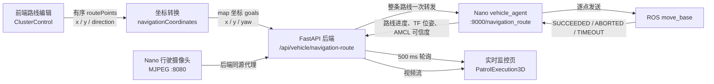

# 项目开发记录：实验楼一定点巡航与实时监控

## 1. 文档信息

| 项目 | 内容 |
| --- | --- |
| 记录日期 | 2026-07-29 |
| 对应提交 | `6524c24 feat: 完善定点巡航与实时监控` |
| 对应分支 | `master` |
| 远程仓库 | `https://github.com/1104546057-cloud/indoor` |
| 适用场景 | 实验楼一 `first_floor` 地图 |
| 适用车辆 | `nano1`，ROS 1 Melodic |
| 前端页面 | `/cluster-control`、`/patrol-3d` |

本文记录提交 `6524c24` 中定点巡航、逐点到达确认、到点朝向、实时车辆位置、路线进度、车载视频和停止巡检等功能的实现，供后续开发、部署和排查问题时参考。

## 2. 本次开发目标

本次开发将原有的前端路线演示能力补全为一条可连接真实车辆的闭环：

1. 用户在实验楼一地图中按顺序选择多个巡检点。
2. 用户可以分别设置每个点的到达朝向。
3. 前端将整条有序路线一次性提交给后端。
4. 后端将路线原样转发给 Nano 上的车辆 agent。
5. 车端只有在前一点被 `move_base` 确认 `SUCCEEDED` 后，才发送下一点。
6. 前端实时读取车端的路线进度、AMCL 位姿和车辆状态。
7. `/patrol-3d` 使用真实 `map → base_link` 位姿更新车辆模型，并显示行驶摄像头视频。
8. 用户可以从监控页取消正在执行的路线。

本次没有把“按时间播放动画”作为真实到点依据。实时模式下的到点数量和任务状态均以车端 `move_base` 执行结果为准。

## 3. 系统数据流



### 3.1 路线下发原则

后端不再在车端缺少路线接口时降级为连续调用多个单点接口。降级发送无法保证前一点已经到达，因此现在要求车端必须提供 `/navigation_route`：

```text
前端完整路线
  → 后端完整转发
    → 车端保存全部 goals
      → goal 1 SUCCEEDED
        → goal 2 SUCCEEDED
          → ...
            → route completed
```

## 4. 已实现功能

### 4.1 多巡检点有序路线

主要代码：

- [frontend/src/pages/ClusterControl.jsx](../frontend/src/pages/ClusterControl.jsx)
- [frontend/src/utils/navigationCoordinates.js](../frontend/src/utils/navigationCoordinates.js)
- [backend/main.py](../backend/main.py)
- [backend/vehicle_client.py](../backend/vehicle_client.py)
- [vehicle/vehicle_agent.py](../vehicle/vehicle_agent.py)

实现内容：

- 实验楼一地图支持点击添加自由巡检点。
- 点位按照用户点击顺序进入 `routePoints`。
- 支持上移、下移、删除、反向执行和清空路线。
- 创建任务时保存完整点位对象，不再只保存点位 ID。
- 下发前将模型坐标转换为 ROS `map` 坐标。
- 后端一次性转发完整 `goals` 数组。
- 车端创建唯一 `execution_id`，在独立线程中顺序执行。
- 每个目标均记录 `queued`、`moving`、`arrived`、`failed` 或 `cancelled` 状态。
- 任一点超时或 `move_base` 返回非 `SUCCEEDED` 时，整条路线进入 `failed`，不会继续发送后续点。

### 4.2 每个巡检点设置到点朝向

路线列表中新增“到点朝向”选择框，支持四个方向：

| 页面选项 | ROS yaw | `map` 坐标含义 |
| --- | ---: | --- |
| 东 | `0` | 朝 `map +X` |
| 北 | `π/2`，约 `1.571` | 朝 `map +Y` |
| 西 | `π`，约 `3.142` | 朝 `map -X` |
| 南 | `-π/2`，约 `-1.571` | 朝 `map -Y` |

实现细节：

- `ARRIVAL_DIRECTIONS` 定义四个方向及页面文案。
- `pointDirections` 保存当前表单中每个点的朝向覆盖值。
- 自由点默认朝向为 `east`。
- `getPlanRoutePoints()` 在创建任务前合并点位和朝向。
- 地图中使用黄色箭头预览每个点的到达朝向。
- 后端 `TaskRoutePointRequest` 增加 `direction` 和 `yaw` 字段。
- `point_payload` 和任务 JSON 中会保留朝向，任务重新读取后不会丢失。
- `modelPointToSlamGoal()` 同时支持方向字符串和数值 yaw。

注意：这里的“东南西北”是 ROS `map` 坐标方向，不是地理罗盘方向。只有地图坐标轴与建筑真实方位经过标定时，两者才会一致。

### 4.3 车端逐点到达确认

[vehicle/vehicle_agent.py](../vehicle/vehicle_agent.py) 新增了可部署到 Nano 的车辆 agent。

核心行为：

- 使用 `actionlib.SimpleActionClient("move_base", MoveBaseAction)`。
- 接收到路线后先检查 `move_base` action server 是否可用。
- 每次只发送一个 `MoveBaseGoal`。
- `wait_for_result()` 返回成功且状态为 `GoalStatus.SUCCEEDED` 后，才更新 `reached_count` 并发送下一点。
- 默认单点超时时间为 `180 s`。
- 默认到点停顿为 `0.5 s`。
- 路线执行过程中，agent 不再发布手动 `/cmd_vel`，避免与 `move_base` 抢占控制。
- 新的手动控制、停止命令或取消路线会调用 `cancel_all_goals()`。
- 已有路线执行时再次下发路线会返回 HTTP `409`。

主要状态字段：

```json
{
  "execution_id": "route-...",
  "active": true,
  "state": "moving",
  "task_id": "task-...",
  "point_id": "LAB-FREE-001",
  "point_name": "自由点1",
  "route_index": 1,
  "route_total": 3,
  "reached_count": 0,
  "results": [],
  "last_error": null
}
```

终态包括：

- `completed`：全部点位成功到达。
- `failed`：某一点超时、被 `move_base` 拒绝或执行异常。
- `cancelled`：用户取消路线或发送停止/手动控制命令。

### 4.4 真实定位与定位可信度

车端 `/status` 不再只返回速度和电压，还会返回真实地图位姿和定位状态：

- TF：`map → base_link`
- AMCL：`/amcl_pose`
- 位置：`x`、`y`
- 姿态：四元数和 yaw
- 位姿时延：`pose_age`
- AMCL 协方差：`covariance_x`、`covariance_y`、`covariance_yaw`

默认可信度限制：

| 参数 | 默认值 |
| --- | ---: |
| `pose_stale_timeout` | `2.0 s` |
| `max_covariance_x` | `0.5` |
| `max_covariance_y` | `0.5` |
| `max_covariance_yaw` | `0.8` |

只有 TF 可用、位姿未过期且 AMCL 协方差不超限时，`localization.valid` 才为 `true`。前端在定位无效时不会继续使用一个看似正常但实际不可信的位置。

### 4.5 `/patrol-3d` 实时监控

主要代码：

- [frontend/src/pages/PatrolExecution3D.jsx](../frontend/src/pages/PatrolExecution3D.jsx)
- [frontend/src/styles/PatrolExecution3D.css](../frontend/src/styles/PatrolExecution3D.css)
- [frontend/src/utils/patrolMonitor.js](../frontend/src/utils/patrolMonitor.js)

实时模式实现：

- 每 `500 ms` 请求一次车辆状态。
- 根据 `execution_id` 请求对应路线状态。
- 使用真实 `map → base_link` 位姿更新 Three.js 中的车辆位置。
- 将 ROS 地图坐标反算为实验楼一模型坐标。
- 使用车端 `route_index` 和 `reached_count` 更新当前点和总进度。
- 显示车辆在线/离线、速度、电压、定位可信度和路线错误。
- 支持实时、俯视和跟随视角。
- 实时视频不可用时每 `3 s` 自动重连，也支持点击立即重试。
- “停止巡检”会调用取消路线接口，不只是暂停网页动画。

回放模式仍然保留，但通过 URL 参数 `replay=1` 与真实模式明确区分。回放模式可以按时间播放；真实模式只信任车端状态。

#### 车辆旋转方向修正

ROS 与 Three.js 的坐标轴定义不同：

- ROS：yaw 为 `0` 时朝 `map +X`，正 yaw 朝 `map +Y` 旋转。
- Three.js 场景：车辆模型车头沿局部 `+Z`，地图 `+Y` 绘制到场景 `-Z`。

当前换算为：

```js
sceneRotation = Math.PI / 2 + rosYaw
```

该修正解决了监控页面中车辆旋转方向与现实相反的问题。

### 4.6 监控上下文保存

[frontend/src/utils/patrolMonitor.js](../frontend/src/utils/patrolMonitor.js) 使用 `sessionStorage` 保存：

- `executionId`
- `taskId`
- `taskName`
- `sceneId`
- `vehicleId`
- `routePoints`
- 转换后的导航目标

上下文分别按照“最新任务、execution ID、task ID”建立索引。刷新 `/patrol-3d` 时可恢复当前浏览器标签页中的监控任务。

注意：`sessionStorage` 仅属于当前浏览器标签页。关闭标签页或换浏览器后，不应依赖它作为永久任务存储；永久任务数据仍由后端数据库保存，真实执行状态仍由车端 agent 保存。

### 4.7 行驶摄像头和同源代理

新增文件：

- [vehicle/indoor-patrol-movement-camera.service](../vehicle/indoor-patrol-movement-camera.service)

实现内容：

- Nano 使用用户级 systemd 服务运行行驶摄像头 MJPEG 服务。
- 默认设备为 `/dev/video0`。
- 默认监听 `0.0.0.0:8080`。
- 默认输出 `640 × 480`、`20 FPS`、JPEG 质量 `85`。
- 服务退出后自动重启。
- 后端增加 `camera_role=movement` 参数。
- 浏览器不直接访问 Nano 私网地址，而是通过 `/api/vehicle/camera/stream` 同源代理视频流。

这样可以避免浏览器跨域、混合内容和私网访问限制导致的视频不可用问题。

### 4.8 数据库兼容迁移

[backend/init_db.py](../backend/init_db.py) 新增幂等的旧库兼容迁移，为 `tb_recognition_result` 检查并补充：

- `inspection_record_id`
- `image_id`
- `device_item_id`
- `numeric_value`
- 对应索引
- 对应外键

原因是 SQLAlchemy `create_all()` 只会创建不存在的表，不会自动修改已存在的表。新迁移会先检查数据库结构，只添加缺失对象。

### 4.9 直线里程计诊断脚本

新增文件：

- [vehicle/collect_straight_odom_diagnostics.sh](../vehicle/collect_straight_odom_diagnostics.sh)

该脚本用于采集直线前进/后退时的：

- `/cmd_vel`
- `/odom`
- `/imu`
- `/tf`

用于判断雷达与地图错位是否来自底盘里程计、编码器或 IMU。它属于定位问题诊断工具，不会自动修复底盘参数。

## 5. 前后端与车端接口

### 5.1 前端调用的后端接口

| 方法 | 路径 | 用途 |
| --- | --- | --- |
| `POST` | `/api/tasks` | 保存任务、点位顺序和到点朝向 |
| `POST` | `/api/vehicle/navigation-route` | 下发整条有序路线 |
| `GET` | `/api/vehicle/navigation-route/status` | 读取指定路线执行状态 |
| `POST` | `/api/vehicle/navigation-route/cancel` | 取消指定路线 |
| `GET` | `/api/vehicle/status` | 读取车辆、TF、AMCL 和导航状态 |
| `GET` | `/api/vehicle/camera` | 获取摄像头信息 |
| `GET` | `/api/vehicle/camera/stream` | 同源代理 MJPEG 视频 |
| `GET` | `/api/vehicle/lidar` | 获取雷达 WebSocket 配置 |

除设备回传接口外，上述页面接口需要有效登录 Cookie。

### 5.2 后端调用的车端接口

| 方法 | 车端路径 | 用途 |
| --- | --- | --- |
| `GET` | `/health`、`/status` | 车辆健康、定位和路线状态 |
| `POST` | `/cmd_vel` | 手动速度控制 |
| `POST` | `/stop` | 停车并取消当前路线 |
| `POST` | `/navigation_goal` | 单个导航目标 |
| `POST` | `/navigation_route` | 接收整条有序路线 |
| `GET` | `/navigation_route/status` | 查询路线进度 |
| `POST` | `/navigation_route/cancel` | 取消路线 |

### 5.3 路线任务中的点位格式

任务保存阶段：

```json
{
  "id": "LAB-FREE-001",
  "name": "自由点1",
  "targetName": "自由点1",
  "x": 72000,
  "y": 17000,
  "direction": "north",
  "yaw": "north"
}
```

导航下发阶段：

```json
{
  "frame_id": "map",
  "x": -2.329,
  "y": -1.907,
  "yaw": 1.571,
  "point_id": "LAB-FREE-001",
  "point_name": "自由点1"
}
```

字符串方向只存在于业务任务中。发送给 ROS 前必须转换为数值弧度。

## 6. 主要文件变更

| 文件 | 变更摘要 |
| --- | --- |
| `frontend/src/pages/ClusterControl.jsx` | 路线编辑、朝向选择、方向箭头、任务上下文、进入实时监控 |
| `frontend/src/styles/ClusterControl.css` | 朝向选择器和地图箭头样式 |
| `frontend/src/utils/navigationCoordinates.js` | 模型坐标转 SLAM 坐标、字符串/数值 yaw 支持 |
| `frontend/src/utils/patrolMonitor.js` | execution/task 监控上下文和 URL 工具 |
| `frontend/src/pages/PatrolExecution3D.jsx` | 真实位姿、真实进度、摄像头、取消路线、回放/实时模式 |
| `frontend/src/styles/PatrolExecution3D.css` | 在线状态、视频重连和监控布局 |
| `frontend/vite.config.js` | `/api` 开发代理统一到后端 `8000` 端口 |
| `backend/main.py` | 路线状态、取消、摄像头角色、任务朝向字段 |
| `backend/vehicle_client.py` | 路线状态/取消代理、禁止不可靠降级、行驶视频流 |
| `backend/init_db.py` | 旧数据库字段、索引和外键兼容迁移 |
| `backend/tests/test_business_loop.py` | 路线状态、取消和朝向持久化自动化测试 |
| `vehicle/vehicle_agent.py` | Nano 端有序路线执行器、TF/AMCL 位姿与状态接口 |
| `vehicle/indoor-patrol-movement-camera.service` | 行驶摄像头 systemd 用户服务 |
| `vehicle/collect_straight_odom_diagnostics.sh` | 直线运动里程计诊断采集 |

## 7. 开发环境启动

### 7.1 后端

在 `backend` 目录中启动：

```powershell
cd backend
C:\Users\20848\.conda\envs\py311\python.exe -m uvicorn main:app --host 127.0.0.1 --port 8000
```

开发时可以增加 `--reload`。

### 7.2 前端

```powershell
cd frontend
npm install
npm run dev -- --host 127.0.0.1
```

访问：

```text
http://localhost:5173/cluster-control
http://localhost:5173/patrol-3d
```

### 7.3 车辆注册配置

真实车辆建议在被 Git 忽略的 `backend/vehicles.json` 中配置，不要将 SSH 密码提交到仓库。

示意配置：

```json
{
  "default_vehicle_id": "nano1",
  "vehicles": [
    {
      "id": "nano1",
      "name": "实验楼一巡检车",
      "agent_base_url": "http://车辆地址:9000",
      "camera_stream_url": "http://车辆地址:8080/",
      "movement_camera_stream_url": "http://车辆地址:8080/",
      "ssh_host": "车辆地址",
      "ssh_port": 22,
      "ssh_username": "车辆用户名",
      "ssh_password": "通过本机配置填写，不提交仓库"
    }
  ]
}
```

## 8. 车端部署要点

### 8.1 同步车辆 agent

将仓库中的：

```text
vehicle/vehicle_agent.py
```

同步到 Nano：

```text
/home/nano1/indoor_patrol_ws/src/indoor_patrol_bringup/scripts/vehicle_agent.py
```

确保运行环境已经 source ROS Melodic 和工作空间，并且以下对象可用：

- ROS master
- `/move_base`
- `map → odom → base_link` TF
- `/amcl_pose`
- `/odom`
- `/cmd_vel`

### 8.2 行驶摄像头服务

将服务文件安装到：

```text
~/.config/systemd/user/indoor-patrol-movement-camera.service
```

然后执行：

```bash
systemctl --user daemon-reload
systemctl --user enable --now indoor-patrol-movement-camera.service
systemctl --user status indoor-patrol-movement-camera.service
```

如果 Nano 的摄像头不是 `/dev/video0`，需要修改服务文件中的 `--device`。

## 9. 用户操作流程

1. 启动 Nano 的底盘、雷达、地图、AMCL、`move_base` 和 vehicle agent。
2. 在 RViz 使用 `2D Pose Estimate` 设置正确初始位姿。
3. 确认激光轮廓与地图墙体重合，粒子云已经收敛。
4. 打开 `/cluster-control`。
5. 新建实验楼一巡检计划。
6. 在有效 SLAM 覆盖区内按执行顺序添加多个点。
7. 为每个点选择到点朝向。
8. 创建任务并下发路线。
9. 点击“监控”进入 `/patrol-3d`。
10. 确认页面显示车辆在线、定位可信、路线进度和实时视频。
11. 如需结束任务，点击“停止巡检”并确认取消。

## 10. 测试与验证记录

本次提交完成时执行了以下验证：

| 验证项 | 结果 |
| --- | --- |
| 前端 ESLint | 通过 |
| Vite 生产构建 | 通过 |
| 后端 `test_business_loop.py` | `7 passed` |
| 任务朝向创建、读取、删除 | 通过 |
| `north` 转换为 yaw | `1.571` |
| 数值 yaw 保持 | 通过 |
| 后端 OpenAPI 包含 `direction/yaw` | 通过 |
| 本机前端端口 `5173` | 正常 |
| 本机后端端口 `8000` | 正常 |

测试过程中没有自动向车辆发送巡检路线，也没有自动启动车辆。

## 11. 常见问题

### 11.1 下发路线返回 HTTP 409

典型信息：

```text
a navigation route is already running
```

原因：车端已有路线处于 `active=true`。

处理：

1. 先查询 `/api/vehicle/navigation-route/status`。
2. 确认旧路线是否仍在执行。
3. 必要时调用 `/api/vehicle/navigation-route/cancel`。
4. 确认状态变为 `cancelled`、`failed` 或 `completed` 后再下发新路线。

不要通过重启网页绕过该限制，因为真实路线运行在车端。

### 11.2 下发路线返回 HTTP 503

可能原因：

- 后端无法访问车辆 agent。
- vehicle agent 未启动。
- 端口 `9000` 不可达。
- ROS master、`move_base` 或 action server 未就绪。

先依次检查：

```text
GET /api/vehicle/status
GET 车辆地址:9000/health
GET 车辆地址:9000/status
```

### 11.3 视频流不可用

检查：

- systemd 用户服务是否为 `active (running)`。
- `/dev/video0` 是否存在。
- MJPEG 服务端口 `8080` 是否监听。
- `movement_camera_stream_url` 是否配置正确。
- 后端 `/api/vehicle/camera/stream?...&camera_role=movement` 是否返回 MJPEG。

### 11.4 监控车辆旋转方向错误

当前正确公式为：

```js
Math.PI / 2 + yaw
```

修改 Three.js 车辆模型的本地车头轴或地图翻转配置时，需要重新验证该公式，不能直接把 yaw 的正负号反转。

### 11.5 雷达与地图行驶后偏离

本次监控功能只读取定位结果，不会修复定位漂移。需要继续检查：

- 底盘 `/odom` 直线和旋转精度。
- 左右轮编码器极性、轮径和轮距。
- IMU 角速度方向和比例。
- 雷达外参。
- AMCL 参数和地图质量。

可以使用 `vehicle/collect_straight_odom_diagnostics.sh` 采集 `/cmd_vel`、`/odom`、`/imu` 和 `/tf` 后对比分析。

## 12. 已知限制与后续建议

### 12.1 已知限制

- 实验楼一当前导航坐标转换只适用于已经标定的 `first_floor` 覆盖区。
- 到点朝向只有四个离散方向，暂不支持任意角度输入。
- 一个 vehicle agent 同时只允许一条导航路线。
- 监控页任务上下文使用 `sessionStorage`，跨浏览器或关闭标签页后不会永久保留。
- 视频流采用 MJPEG，带宽利用率不如 H.264/WebRTC。
- AMCL 失效、TF 过期或协方差超限时，监控页无法提供可信位置。
- 路线已经被车端接收后，前后端网络短时断开不会自动取消 `move_base`；但网页会失去实时状态，恢复网络后应重新查询 execution 状态。

### 12.2 建议的下一步

1. 把路线执行状态定期回写数据库，减少对浏览器 `sessionStorage` 的依赖。
2. 为车端设备回传接口增加 API Key 或设备证书。
3. 将 SSH 密码迁移到密钥或安全配置服务。
4. 增加任意角度 yaw 输入和地图交互式朝向拖拽。
5. 为路线增加到点停留时间、拍照动作和识别任务配置。
6. 为摄像头增加 H.264/WebRTC 低延迟通道。
7. 增加 vehicle agent systemd 服务、日志轮转和健康检查。
8. 修正底盘里程计漂移后，再扩大实验楼一完整地图覆盖范围。
9. 增加真实车辆环境中的端到端测试：下发、逐点到达、取消、断网恢复和异常点超时。

## 13. 组内交接检查清单

接手或部署前请确认：

- [ ] 已拉取包含提交 `6524c24` 的 `master`。
- [ ] 前端代理端口为 `8000`。
- [ ] 后端 `vehicles.json` 已在本机正确配置且未提交密码。
- [ ] Nano 上 vehicle agent 与仓库版本一致。
- [ ] Nano 上行驶摄像头服务正常。
- [ ] `move_base`、AMCL、地图和 TF 正常。
- [ ] RViz 初始位姿已经校准。
- [ ] 页面新增点位位于 SLAM 有效覆盖区。
- [ ] 每个点的到点朝向已经复核。
- [ ] 下发前确认没有另一条 active 路线。
- [ ] 实车测试区域已清场并准备急停。

## 14. 相关文档

- [实验楼一定点巡航完整启动与操作指南](实验楼一定点巡航完整启动与操作指南.md)
- [实验楼一固定巡检点有序路线使用指南](实验楼一固定巡检点有序路线使用指南.md)
- [实验楼一巡检实时监控使用指南](实验楼一巡检实时监控使用指南.md)
- [定点巡航功能实现科研笔记](定点巡航功能实现科研笔记.md)

